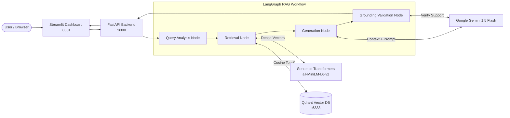

# RAG Knowledge Assistant

RAG Knowledge Assistant is a Retrieval-Augmented Generation system designed for document question-answering, multi-document comparison, contradiction detection, and targeted summarization over PDF documents. It addresses the common challenges of ungrounded answers and opaque sourcing by coupling structured vector retrieval with deterministic provenance tracking and a verification workflow. The system is built with FastAPI, LangGraph, Qdrant, Sentence Transformers, Google Gemini, and Streamlit.

---

## Features

- **Grounded Document Q&A**: Answers user questions strictly using retrieved PDF context; if relevant information is absent, the system returns an explicit refusal rather than speculating.
- **Page-Level Provenance & Citations**: Every generated answer includes source citations specifying the exact PDF filename, 1-indexed page number, chunk ID, and similarity score.
- **Cross-Document Comparison**: Performs targeted semantic comparison across two documents on a specified topic, outlining policy differences, additions, and modifications.
- **Contradiction Detection**: Analyzes retrieved passages across documents to identify conflicting claims, attributing opposing statements to their respective sources and pages.
- **Targeted Topic Summarization**: Focuses summarization on user-specified topics across single or multiple documents, avoiding broad, unfocused summaries.
- **Persistent Vector Storage & Scoped Filtering**: Uses Qdrant vector storage with disk persistence, supporting cosine similarity search and payload filtering by single or multiple document IDs.
- **Automated Evaluation Benchmark**: Includes an evaluation harness that tests retrieval recall@k, grounding accuracy, citation accuracy, and refusal behavior against a ground-truth dataset.

---

## Architecture



The system uses a decoupled architecture:
1. **Frontend**: A Streamlit application (`frontend/streamlit_app.py`) provides an interactive interface for document uploads, Q&A, comparison, contradiction detection, summarization, and benchmark inspection.
2. **Backend**: A FastAPI application (`app/main.py`) exposes typed REST endpoints and coordinates data ingestion, storage, and retrieval services.
3. **Workflow Engine**: A compiled LangGraph `StateGraph` (`app/workflows/rag_graph.py`) orchestrates execution across four explicit state nodes: query analysis, vector retrieval, answer generation, and grounding validation.
4. **Vector Store**: Qdrant runs as a containerized service with local disk storage, indexing 384-dimensional dense vectors alongside rich payload metadata.

---

## How It Works

1. **Document Ingestion & PDF Parsing**: When a PDF is uploaded, PyMuPDF (`fitz`) parses the file page-by-page. The system extracts raw text while preserving 1-indexed page numbers and computes a deterministic SHA-256 hash of the file bytes as the document ID (`doc_id`).
2. **Chunking with Provenance**: Text from each page is split using LangChain's `RecursiveCharacterTextSplitter` (chunk size: 500 characters, chunk overlap: 50 characters). Each chunk receives a deterministic identifier (`{doc_id}_p{page}_c{chunk_index}`) and metadata storing its filename, page number, and offset.
3. **Embedding Generation**: Chunks are encoded locally into 384-dimensional dense vectors using the `sentence-transformers/all-MiniLM-L6-v2` model. Local inference eliminates embedding API costs and external rate limits.
4. **Vector Indexing**: Chunks and their embeddings are stored in Qdrant with deterministic UUIDv5 identifiers. Metadata payloads (document ID, filename, page number, text) are attached to each point, enabling filtered search.
5. **Query Analysis & Retrieval**: A user query enters the LangGraph workflow. An analysis node optimizes the query into focused search keywords. The retrieval node embeds the query and executes cosine similarity search in Qdrant, applying optional document ID filters (`doc_id` or `doc_ids`).
6. **Grounded Generation & Validation**: Gemini 1.5 Flash generates an answer constrained strictly to retrieved chunks. A validation node checks the response against the context. If the query cannot be answered from the retrieved passages, the system returns a standard refusal message (`"I couldn't find this information in the uploaded documents."`). Otherwise, citations are extracted directly from chunk metadata.

---

## Tech Stack

| Technology | Purpose |
|---|---|
| **Python 3.11** | Core application runtime |
| **FastAPI** | Asynchronous REST API framework and route handling |
| **Streamlit** | Interactive web dashboard and UI client |
| **LangGraph** | Multi-node state machine workflow orchestration |
| **LangChain Text Splitters** | Recursive character text chunking with metadata preservation |
| **Qdrant** | Vector database for cosine similarity search and payload filtering |
| **Sentence Transformers** | Local dense vector embeddings (`all-MiniLM-L6-v2`, 384 dimensions) |
| **Google Gemini** | LLM for answer generation, query analysis, and grounding validation (`gemini-1.5-flash`) |
| **PyMuPDF (`fitz`)** | PDF text extraction and page metadata extraction |
| **Pydantic v2** | Data validation, request/response models, and environment settings |
| **Docker & Docker Compose** | Containerized deployment of the Qdrant service |
| **Pytest** | Automated unit and integration testing suite |

---

## Project Structure

```
rag_project/
├── app/
│   ├── api/
│   │   └── routes.py             # FastAPI REST endpoints
│   ├── comparison/
│   │   └── comparator.py         # Cross-document comparison & contradiction logic
│   ├── core/
│   │   ├── embeddings.py         # Sentence Transformers embedding service
│   │   └── vector_store.py       # Qdrant client connection & collection management
│   ├── evaluation/
│   │   └── evaluator.py          # Benchmark runner (recall, grounding, citations)
│   ├── ingestion/
│   │   ├── chunker.py            # LangChain text splitter with chunk provenance
│   │   └── pdf_loader.py         # PyMuPDF PDF parser and document hashing
│   ├── llm/
│   │   ├── gemini_client.py      # Google Gemini client integration
│   │   └── prompts.py            # System prompts and refusal templates
│   ├── models/
│   │   └── schemas.py            # Pydantic request, response, and entity schemas
│   ├── retrieval/
│   │   └── retriever.py          # Qdrant similarity search with filter support
│   ├── workflows/
│   │   └── rag_graph.py          # LangGraph 4-node state machine workflow
│   ├── config.py                 # Application settings and environment parsing
│   └── main.py                   # FastAPI app initialization and lifespan events
├── frontend/
│   ├── api_client.py             # Python HTTP client for FastAPI communication
│   └── streamlit_app.py          # Streamlit UI (Q&A, Compare, Contradictions, Eval)
├── data/
│   ├── documents/                # Ingested PDF document storage
│   ├── qdrant_storage/           # Qdrant local persistence directory
│   └── evaluation_dataset.json   # Benchmark test cases with ground-truth facts
├── scripts/
│   ├── check_health.py           # Quick sanity check for service connectivity
│   ├── sample_docs_generator.py  # Generates test PDFs with overlapping/conflicting policies
│   └── verify_rag.py             # End-to-end command-line verification script
├── tests/                        # 39 automated unit and integration tests
├── docker-compose.yml            # Docker Compose configuration for Qdrant
├── requirements.txt              # Project dependencies
├── .env.example                  # Environment variable template
└── README.md
```

---

## Setup & Installation

### 1. Prerequisites

- Python 3.11+
- Docker and Docker Compose
- Google Gemini API Key ([Google AI Studio](https://aistudio.google.com/))

### 2. Clone Repository & Setup Environment

```bash
git clone https://github.com/dishaasija315/rag-knowledge-assistant.git
cd rag-knowledge-assistant

# Create and activate virtual environment
python -m venv venv

# Windows:
venv\Scripts\activate

# Linux / macOS:
source venv/bin/activate

# Install dependencies
pip install -r requirements.txt
```

### 3. Configure Environment Variables

Copy `.env.example` to `.env` and set your Gemini API key:

```bash
cp .env.example .env
```

Configure `.env` parameters:

```env
GEMINI_API_KEY=your_gemini_api_key_here
GEMINI_MODEL_NAME=gemini-1.5-flash
QDRANT_HOST=localhost
QDRANT_PORT=6333
QDRANT_COLLECTION_NAME=rag_documents
EMBEDDING_MODEL_NAME=sentence-transformers/all-MiniLM-L6-v2
EMBEDDING_DIMENSION=384
CHUNK_SIZE=500
CHUNK_OVERLAP=50
DOCUMENTS_STORAGE_PATH=./data/documents
API_HOST=0.0.0.0
API_PORT=8000
```

### 4. Start Qdrant Vector Database

```bash
docker compose up -d
```

Verify that the Qdrant service is running at `http://localhost:6333`.

### 5. Start the FastAPI Backend

```bash
python -m uvicorn app.main:app --host 0.0.0.0 --port 8000 --reload
```

The interactive API documentation is accessible at `http://localhost:8000/docs`.

### 6. Start the Streamlit Frontend

In a separate terminal (with virtual environment activated):

```bash
python -m streamlit run frontend/streamlit_app.py --server.port 8501
```

The dashboard will open at `http://localhost:8501`.

---

## Environment Variables

| Variable | Default Value | Description |
|---|---|---|
| `GEMINI_API_KEY` | *(Required)* | API key for Google Gemini model access |
| `GEMINI_MODEL_NAME` | `gemini-1.5-flash` | Gemini model variant for generation and validation |
| `QDRANT_HOST` | `localhost` | Hostname of the Qdrant vector database |
| `QDRANT_PORT` | `6333` | REST API port for Qdrant |
| `QDRANT_COLLECTION_NAME` | `rag_documents` | Target Qdrant collection name |
| `EMBEDDING_MODEL_NAME` | `sentence-transformers/all-MiniLM-L6-v2` | Hugging Face model identifier for embeddings |
| `EMBEDDING_DIMENSION` | `384` | Embedding vector dimension for collection configuration |
| `CHUNK_SIZE` | `500` | Target character size for chunking |
| `CHUNK_OVERLAP` | `50` | Character overlap between consecutive chunks |
| `DOCUMENTS_STORAGE_PATH` | `./data/documents` | Filesystem path for ingested PDF copies |
| `API_HOST` | `0.0.0.0` | Host interface for FastAPI server |
| `API_PORT` | `8000` | Port for FastAPI server |

---

## API Endpoints

| Method | Endpoint | Description |
|---|---|---|
| `POST` | `/documents/upload` | Upload a PDF file, extract page text, chunk, embed, and index into Qdrant |
| `GET` | `/documents` | List all indexed documents with page and chunk counts |
| `DELETE` | `/documents/{document_id}` | Delete a document and its indexed vector points from Qdrant |
| `POST` | `/query` | Execute the LangGraph grounded Q&A workflow with source citations |
| `POST` | `/compare` | Perform targeted semantic comparison between two indexed documents on a topic |
| `POST` | `/contradictions` | Scan cross-document context to identify factual contradictions on a topic |
| `POST` | `/summarize` | Generate a targeted summary of document sections relevant to a topic |
| `GET` | `/evaluation` | Run the automated RAG benchmark evaluation suite against ground truth |
| `GET` | `/health` | Health check endpoint returning status of FastAPI, Qdrant, and embedding model |

---

## Testing

The project includes an automated test suite covering unit functionality, vector store integration, retrieval filtering, and API endpoints.

To run the complete test suite:

```bash
pytest
```

The test suite contains **39 tests** covering:
- **API routes** (`tests/test_api.py`): Document upload, listing, deletion, and query routing.
- **Ingestion & parsing** (`tests/test_ingestion.py`): PDF loading, page extraction, and edge cases (empty or invalid PDFs).
- **Chunking logic** (`tests/test_chunking.py`): Chunk size, overlap bounds, and metadata provenance tagging.
- **Embedding service** (`tests/test_embeddings.py`): Dimension validation, batch encoding, and normalization.
- **Vector store operations** (`tests/test_vector_store.py`): Point insertion, deduplication, and payload filtering.
- **Retriever functionality** (`tests/test_retrieval.py`): Cosine ranking, score thresholds, and single/multi-document scoping.
- **LangGraph workflow** (`tests/test_rag_workflow.py`): Node transitions, state updates, and refusal triggers.
- **Comparison & Contradictions** (`tests/test_comparison.py`): Dual-document retrieval and conflict extraction.
- **Benchmark evaluation** (`tests/test_evaluation.py`): Metric computations across test dataset samples.

---

## Design Decisions

- **Why Qdrant**: Qdrant provides fast vector search, native support for cosine distance, and payload-based filtering. This allows filtering chunks by `doc_id` or multiple document scopes without creating separate vector collections per document.
- **Why Sentence Transformers (`all-MiniLM-L6-v2`)**: Running embeddings locally removes external API rate limits, lowers latency during batch chunking, eliminates cost per embedding call, and outputs compact 384-dimensional vectors.
- **Why LangGraph**: Rather than relying on rigid linear chains, LangGraph uses an explicit state machine. Each stage (query analysis, retrieval, generation, validation) is an observable node with explicit inputs, outputs, and conditional checks.
- **Why FastAPI + Streamlit**: FastAPI manages typed, asynchronous endpoints and heavy backend processing, while Streamlit delivers a lightweight, reactive UI for document exploration and evaluation benchmarking.
- **Why Page-Level Metadata Citations**: Storing `page_number` and `chunk_id` alongside text chunks in Qdrant ensures citations are generated from real retrieved payload metadata rather than LLM-generated references.

---

## Future Improvements

- **Hybrid Search**: Combine dense vector retrieval with BM25 sparse lexical search to improve keyword precision for acronyms and specific identifiers.
- **Cross-Encoder Reranking**: Add a secondary reranking step (e.g., using `cross-encoder/ms-marco-MiniLM-L-6-v2`) over initial retrieval results before passing context to the LLM.
- **Streaming Responses**: Implement Server-Sent Events (SSE) in FastAPI and token streaming in Streamlit to reduce perceived response latency.
- **Multimodal Document Parsing**: Incorporate table extraction and OCR processing for scanned PDFs and embedded document images.
- **Conversational Memory**: Introduce session-based conversation history into the LangGraph state to support multi-turn contextual follow-ups.


